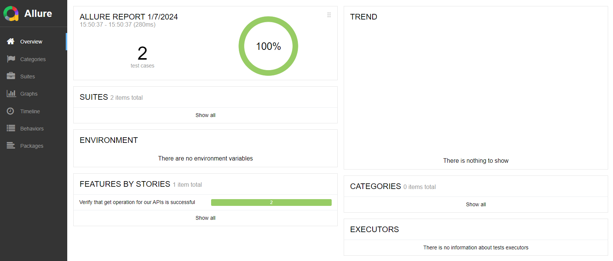
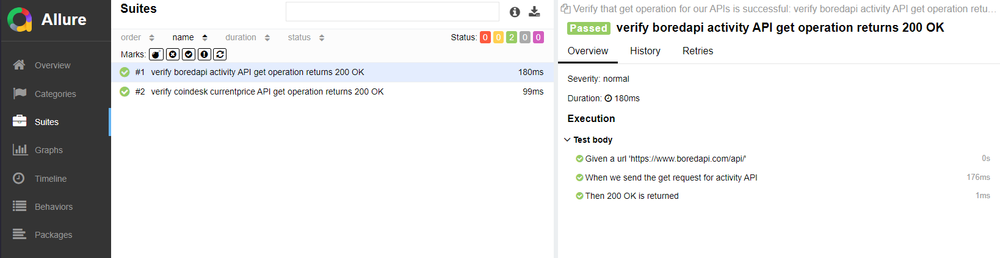

# Test Automation Demo #
This repo is created with sample code to show how to implement Test Automation with Python and BDD Framework
## Install ##
1. download pythod - https://www.python.org/downloads/
    * Make sure to add python home directory and python scripts directory to your PATH environment variable
2. Download latest version of allure framework: https://github.com/allure-framework/allure2/releases
    * download zip file
    * unzip and add the bin folder to your PATH environment variable
3. Install required python packages

```bash
pip install requests
pip install behave
pip install allure-behave
```
## Run Test ##
1. Tests are defined in the features directory as feature files.  This example only contains a single file, getAPI.feature
    * stepImpl.py defines the implementation of the steps needed to be executed from the feature file(s)
    * when tests are run using behave, all feature files under the features directory are exercised by default
2. Run the tests

```bash
behave -f allure_behave.formatter:AllureFormatter -o Reports
```

3. See report using allure

```bash
allure serve Reports
```



## References ##
* https://www.jetbrains.com/pycharm/
* https://www.digitalocean.com/community/tutorials/python-data-types
* https://cucumber.io/docs/installation/
* https://behave.readthedocs.io/en/latest/gherkin/
* https://behave.readthedocs.io/en/latest/tutorial/#python-step-implementations
